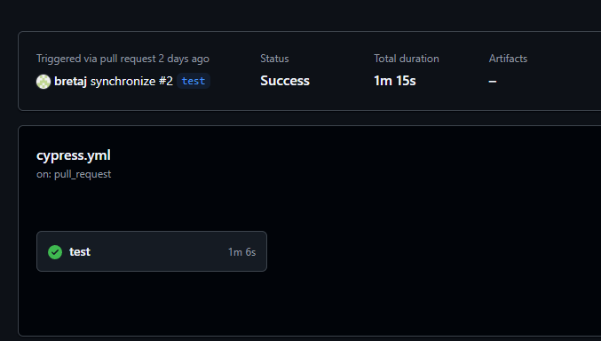
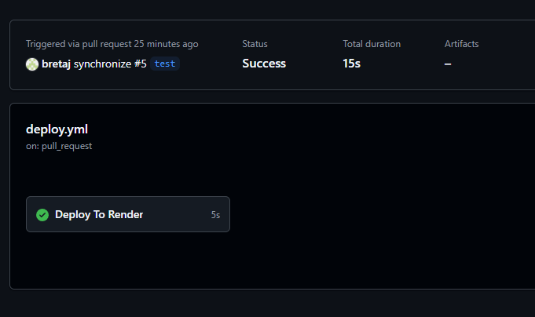
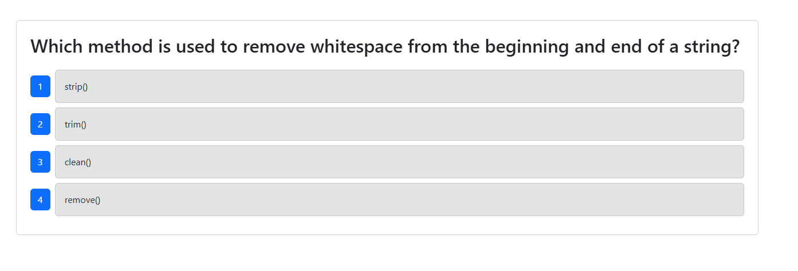

# Bret's CI/CD deploy & test pipeline 

## Description

this project utilizes cypress, mongoDB, Mongo Atlas to create a CI/CD testing and deployment pipeline

## Table of Contents
- [Installation](#installation)
- [Usage](#usage)
- [License](#license)
- [Contributing](#contributing)
- [Tests](#tests)
- [Questions](#questions)

## Installation
To install dependencies, run the following command:
npm i
   
## Usage
to see how this works, [click here](https://cicd-laz7.onrender.com/)

## License

## Contributing 
please create your own branch

## Tests
  
## Questions

If you have any questions, please reach out to me at 
[jensenbret13@gmail.com](mailto:jensenbret13@gmail.com).
GitHub: [bretaj](https://github.com/bretaj)

